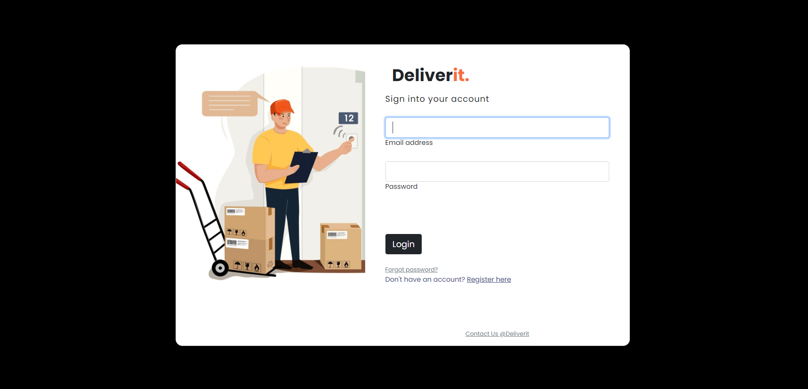
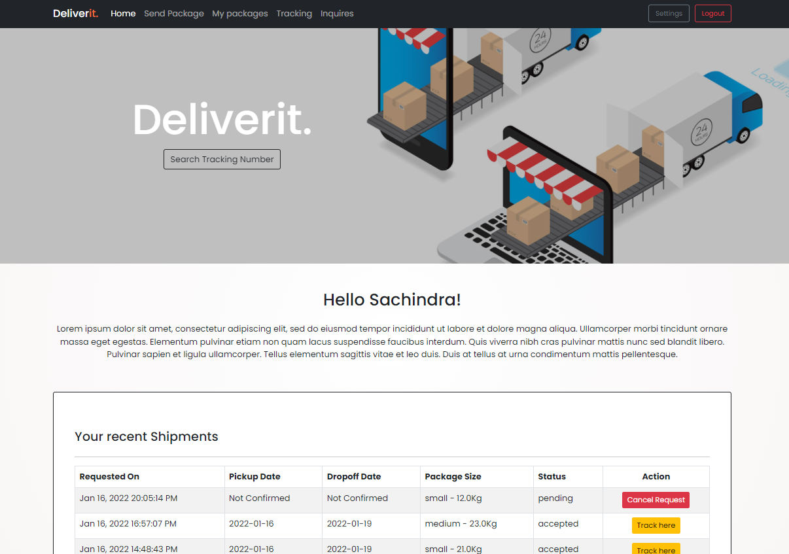
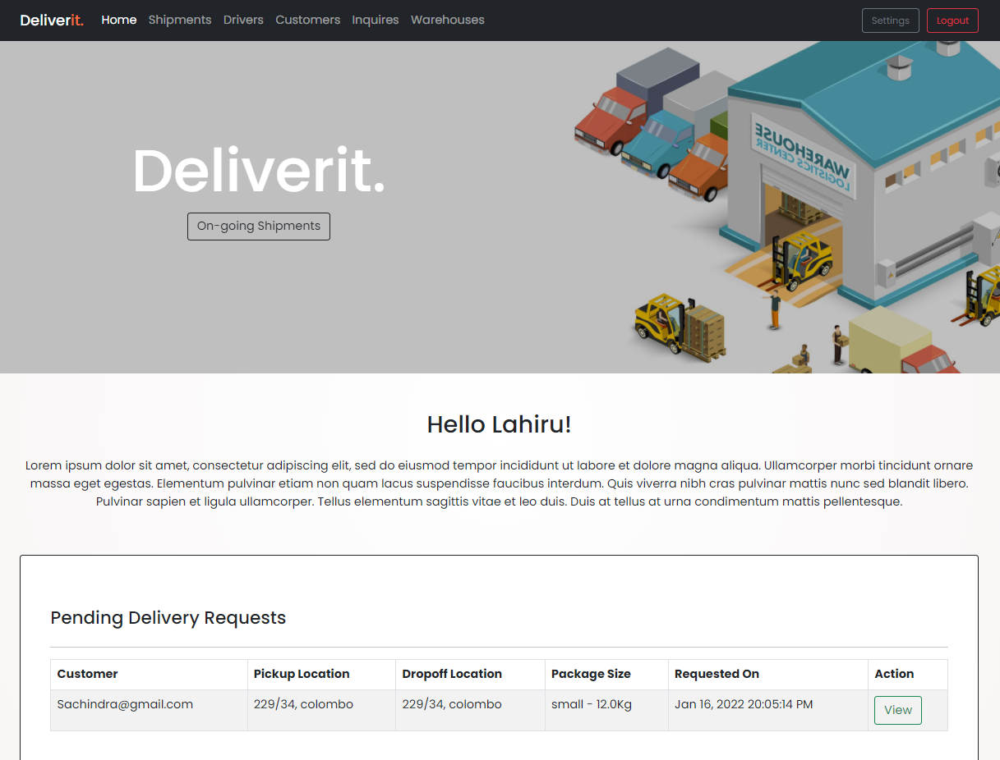
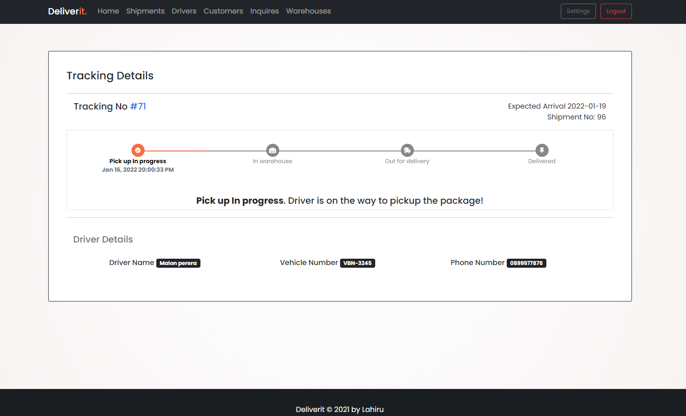

`All rights for the source code and other related material are reserved`

# Deliverit

Deliverit is an attractive, robust and expandable system to manage parcel deliveries and related activities in a courier service environment.

Solution comprises many J2EE and SE features including,

- Context and Dependency Injection
- Concurrency
- Bean validation
- Java Security
- Java Servlets including JSP and JSTL
- Java Persistence API
- Java transactions API
- Java Mail

